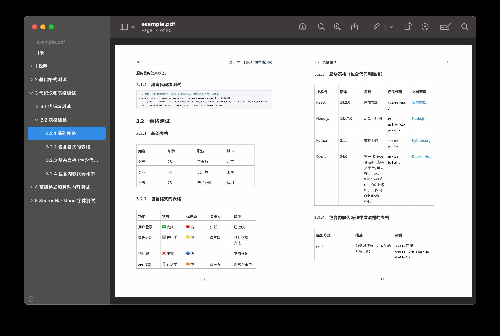

# PDF Book Exporter

A comprehensive tool for exporting Hugo book directories to professional PDF files, with enhanced support for multilingual content, emoji rendering, and customizable styling.


## ✨ Features

- 📚 **Hugo Book Structure Support** - Automatically processes `_index.md` and `index.md` files with weight-based ordering
- 🌍 **Multilingual Support** - CJK (Chinese, Japanese, Korean) character rendering with font auto-detection
- 🎨 **Enhanced Cover System** - Dynamic text overlay on cover images with customizable fonts, colors, and positioning
- 💻 **Advanced Code Highlighting** - Syntax highlighting for 20+ programming languages with customizable themes
- 📊 **Smart Table Processing** - Auto-wrapping tables with enhanced formatting and break handling
- 🎉 **Comprehensive Emoji Support** - Unicode emoji rendering with fallback font chains
- 🎨 **Customizable Color Palettes** - Full typography and styling customization
- ⚡ **Intelligent Caching** - Image processing cache with automatic invalidation
- 🔧 **Flexible PDF Engines** - XeLaTeX and LuaLaTeX support with automatic engine selection
- 📱 **Cross-Platform** - Works on macOS, Linux, and Windows

## 🚀 Quick Start

### Prerequisites

```bash
# Install Pandoc (required)
# macOS
brew install pandoc

# Ubuntu/Debian
sudo apt-get install pandoc

# Windows
# Download from https://pandoc.org/installing.html

# Install LaTeX distribution (TeX Live recommended)
# macOS
brew install --cask mactex

# Ubuntu/Debian
sudo apt-get install texlive-full

# Windows
# Download TeX Live or MiKTeX
```

### Basic Usage

```bash
# Export a Hugo book to PDF
python cli.py /path/to/book/directory -o output.pdf

# Generate with cover and summary
python cli.py /path/to/book/directory \
    -o professional-book.pdf \
    --generate-summary

# Enable emoji support with automatic engine optimization
python cli.py /path/to/book/directory \
    -o emoji-book.pdf \
    --emoji
```

## 📖 Examples

You can export the built-in example book to PDF with the following command:

```bash
python cli.py example -o example.pdf --emoji
```



### Example 1: Basic Book Export

```bash
# Directory structure
content/zh/book/my-handbook/
├── _index.md          # Book metadata and config
├── chapter1/
│   └── index.md       # Chapter 1 content
├── chapter2/
│   └── index.md       # Chapter 2 content
└── images/
    └── cover.jpg      # Optional cover image

# Export command
python cli.py content/zh/book/my-handbook \
    -o static/files/my-handbook.pdf \
    --generate-summary
```

### Example 2: Emoji-Enabled Technical Documentation

```bash
# Export with emoji support and diagnostics
python cli.py content/zh/book/tech-guide \
    -o tech-guide-with-emoji.pdf \
    --emoji \
    --diagnostics

# Example output
✅ Emoji fonts detected: Apple Color Emoji, Noto Color Emoji
🎨 Using emoji font: Apple Color Emoji
🚀 PDF generated successfully at tech-guide-with-emoji.pdf
```

### Example 3: Custom Template and Appendix

```bash
# Use custom template with appendix
python cli.py content/zh/book/research-paper \
    -o research-paper.pdf \
    --template custom-template.tex \
    --appendix bibliography.md
```

### Example 4: Draft Content and Cache Management

```bash
# Include draft content
python cli.py content/zh/book/work-in-progress \
    -o draft-book.pdf \
    --include-drafts

# Manage cache
python cli.py --cache-info content/zh/book/my-book
python cli.py --clean-cache 30 content/zh/book/my-book
```

## 🎨 Customizable Palettes and Styling

### Color Palette Configuration

Configure document-wide color schemes in your book's `_index.md`:

```yaml
---
title: "My Professional Book"
book:
  # Typography color palette
  body_color: "#2C3E50"        # Main text color
  heading_color: "#34495E"     # All heading levels
  link_color: "#3498DB"        # Hyperlinks and references
  code_color: "#E74C3C"        # Inline code snippets
  quote_color: "#7F8C8D"       # Blockquotes and citations
  caption_color: "#95A5A6"     # Figure and table captions

  # Enhanced cover customization
  cover: "professional-cover.jpg"
  cover_title_text: "Advanced Data Science"
  cover_author_text: "Dr. Jane Smith"
  cover_subtitle_text: "A Comprehensive Guide"
  
  # Cover color scheme
  cover_title_color: "#FFFFFF"
  cover_author_color: "#ECF0F1"
  cover_subtitle_color: "#BDC3C7"
  
  # Font sizes (points)
  cover_title_font_size: 48
  cover_author_font_size: 24
  cover_subtitle_font_size: 18
  
  # Layout positioning
  cover_title_position: "center"    # top, center, bottom
  cover_author_position: "bottom"   # top, center, bottom
---
```

### Predefined Color Themes

#### Professional Theme

```yaml
book:
  body_color: "#2C3E50"
  heading_color: "#34495E" 
  link_color: "#3498DB"
  code_color: "#E74C3C"
  quote_color: "#7F8C8D"
```

#### Academic Theme

```yaml
book:
  body_color: "#2E3440"
  heading_color: "#5E81AC"
  link_color: "#88C0D0"
  code_color: "#BF616A"
  quote_color: "#4C566A"
```

#### Warm Theme

```yaml
book:
  body_color: "#3E2723"
  heading_color: "#5D4037"
  link_color: "#FF5722"
  code_color: "#D84315"
  quote_color: "#6D4C41"
```

### Advanced Cover Customization

```yaml
book:
  # Visual effects
  cover_overlay_enabled: true
  cover_text_shadow: true
  cover_background_overlay: true
  cover_overlay_opacity: 0.6

  # Advanced positioning
  cover_title_position: "center"
  cover_author_position: "bottom"
  
  # Custom export date format
  cover_export_date: "2024 年 1 月"
```

### Code Block Styling

The tool automatically applies syntax highlighting with customizable color schemes:

```markdown
```python
def hello_world():
    print("Hello, World! 🌍")
    return {"status": "success", "emoji": "✅"}
```

# SQL example with automatic highlighting

```sql
SELECT user_name, COUNT(*) as total_orders 
FROM orders 
WHERE created_date >= '2024-01-01'
GROUP BY user_name;
```

```

Supported languages: Python, JavaScript, Go, Rust, Java, C++, SQL, YAML, JSON, Bash, HTML, CSS, and more.

## 🔧 API Reference

### Core Functions

#### `build_pdf(book_dir, root_node, output_pdf, metadata, **options)`

Main PDF generation function.

**Parameters:**
- `book_dir` (str): Path to Hugo book directory
- `root_node` (Node): Parsed book structure tree
- `output_pdf` (str): Output PDF file path
- `metadata` (dict): Book configuration and metadata
- `template_path` (str, optional): Custom LaTeX template path
- `appendix_path` (str, optional): Additional content to append
- `emoji` (bool): Enable comprehensive emoji support

**Example:**
```python
from export_book_pdf import build_pdf, build_tree, load_config

# Parse book structure
root_node = build_tree("content/zh/book/my-book")
config = load_config("content/zh/book/my-book")

# Generate PDF
build_pdf(
    book_dir="content/zh/book/my-book",
    root_node=root_node,
    output_pdf="output.pdf",
    metadata=config,
    emoji=True
)
```

## 🛠️ CLI Reference

### Basic Commands

```bash
# Core export command
python cli.py <book_directory> [OPTIONS]
```

### Command Line Options

| Flag | Description | Example |
|------|-------------|---------|
| `-o, --output` | Output PDF file path | `-o my-book.pdf` |
| `--generate-summary` | Create GitBook-style summary.md | `--generate-summary` |
| `--template` | Custom LaTeX template path (XeLaTeX only) | `--template custom.tex` |
| `--appendix` | Append additional content | `--appendix refs.md` |
| `--emoji` | Enable emoji support with automatic engine selection | `--emoji` |
| `--include-drafts` | Include draft content | `--include-drafts` |
| `--diagnostics` | Run system compatibility diagnostics | `--diagnostics` |
| `--clean-cache` | Clean cache files (optional: days) | `--clean-cache 30` |
| `--cache-info` | Display cache information | `--cache-info` |
| `--generate-troubleshooting-guide` | Generate troubleshooting guide | `--generate-troubleshooting-guide` |
| `--max-table-width` | Maximum table width as fraction of text width | `--max-table-width 0.95` |

### Advanced Usage Examples

#### Comprehensive Diagnostics

```bash
# Run full system diagnostics
python cli.py --diagnostics
# Output:
# 🔍 System validation: ✅ PASSED
#    ✅ LuaLaTeX Engine
#    ✅ Emoji Fonts (Apple Color Emoji)
#    ✅ Pandoc Available
#    ✅ Required LaTeX Packages
```

#### Cache Management

```bash
# View cache statistics
python cli.py --cache-info content/zh/book/handbook
# Output:
# Cache directory: /path/to/cache
# Cache files: 15
# Total cache size: 12.34MB

# Clean old cache files
python cli.py --clean-cache 30 content/zh/book/handbook
# Output: Cleaned 8 cache files older than 30 days.
```

#### Draft Content Processing

```bash
# Include draft chapters (with draft: true in front matter)
python cli.py content/zh/book/work-in-progress \
    -o draft-version.pdf \
    --include-drafts
```

## 📄 Workflow Integration

### Hugo Integration

The tool seamlessly integrates with Hugo book themes:

```yaml
# hugo.yaml or config.yaml
params:
  book:
    pdf_export: true
    pdf_output_dir: "static/files"
```

### Automated Build Integration

#### GitHub Actions

```yaml
name: Generate PDF Books
on:
  push:
    paths: ['content/zh/book/**']

jobs:
  pdf-export:
    runs-on: ubuntu-latest
    steps:
      - uses: actions/checkout@v3
      
      - name: Install LaTeX
        run: sudo apt-get install texlive-full
        
      - name: Install Pandoc
        run: sudo apt-get install pandoc
        
      - name: Generate PDF
        run: |
          python tools/pdf-book-exporter/cli.py \
            content/zh/book/my-handbook \
            -o static/files/my-handbook.pdf \
            --emoji --generate-summary
            
      - name: Upload PDF
        uses: actions/upload-artifact@v3
        with:
          name: generated-pdfs
          path: static/files/*.pdf
```

## ⚠️ Known Limitations

### Current Limitations

- **Template Compatibility**: Custom templates (`--template`) only work with XeLaTeX engine
- **Emoji Font Dependencies**: Emoji support requires system-installed emoji fonts (Apple Color Emoji, Noto Color Emoji, etc.)
- **LaTeX Engine Switching**: The tool automatically selects between XeLaTeX and LuaLaTeX based on emoji requirements
- **Table Width Processing**: Very wide tables may require manual adjustment of `--max-table-width` parameter
- **Image Format Support**: WebP images are automatically converted to PNG, which may increase processing time
- **Cache Dependencies**: Image processing cache is tied to file modification times and may require manual clearing after system changes

### Performance Considerations

- **Large Books**: Processing time increases significantly for books with 200+ pages
- **Image-Heavy Content**: Books with many images may require substantial cache space
- **Font Loading**: First-time emoji font detection adds ~2-3 seconds to processing time
- **Memory Usage**: Large tables and complex formatting may require 2GB+ RAM

### Compatibility Notes

- **Operating Systems**: Full emoji support requires macOS 10.12+, Ubuntu 18.04+, or Windows 10+
- **LaTeX Distributions**: TeX Live 2020+ recommended for best compatibility
- **Pandoc Version**: Requires Pandoc 2.14+ for optimal table processing

## 📋 Content Guidelines

### Book Structure

```
content/zh/book/my-handbook/
├── _index.md              # Required: Book metadata
├── chapter1-introduction/
│   └── index.md          # Chapter content
├── chapter2-basics/
│   └── index.md
├── chapter3-advanced/
│   ├── index.md
│   └── images/           # Chapter-specific images
│       └── diagram.png
├── images/               # Book-level images
│   ├── cover.jpg        # Optional: Book cover
│   └── backcover.jpg    # Optional: Back cover
└── SUMMARY.md           # Generated automatically
```

### Front Matter Configuration

#### Book-level (`_index.md`)

```yaml
---
title: "Complete Programming Guide"
weight: 1
book:
  title: "Complete Programming Guide"
  author: "Jane Developer"
  date: "2024-01-15"
  description: "A comprehensive guide to modern programming"
  language: "zh-hans"
  
  # PDF-specific settings
  cover: "cover.jpg"
  appendix: true
  
  # Back-cover configuration (optional)
  backcover_image: "back_qr.png"   # relative path, any raster img
  backcover_text: |
    **扫码关注公众号**  
    https://my.site/book
  
  # Color customization
  body_color: "#2C3E50"
  heading_color: "#34495E"
  link_color: "#3498DB"
  
  # Cover customization
  cover_title_text: "完整编程指南"
  cover_author_text: "张三"
  cover_title_color: "#FFFFFF"
  cover_author_color: "#ECF0F1"
---

# Introduction

This book covers comprehensive programming concepts...
```

#### Chapter-level (`index.md`)

```yaml
---
title: "Getting Started"
weight: 10
draft: false           # Set to true to exclude from PDF
publish: true          # Set to false to exclude from PDF  
export_pdf: true       # Set to false to exclude from PDF
---

# Getting Started

Welcome to the first chapter...
```

### Content Exclusion

Control which content appears in PDF exports:

```yaml
---
title: "Work in Progress Chapter"
weight: 99
draft: true          # Excluded unless --include-drafts
publish: false       # Always excluded
export_pdf: false    # Excluded from PDF only
pdf: false          # Alternative to export_pdf
---
```

## 🎯 Advanced Features

### Multi-Language Support

```yaml
book:
  language: "zh-hans"    # Chinese Simplified
  # Automatic font selection:
  # - Source Han Sans SC (preferred)
  # - Noto Sans CJK SC
  # - PingFang SC (macOS)
```

### Emoji Rendering

```bash
# Enable comprehensive emoji support
python cli.py content/book/emoji-guide \
    -o emoji-guide.pdf \
    --emoji

# The tool automatically:
# ✅ Detects system emoji fonts
# 🎨 Configures optimal rendering engine
# 🚀 Provides fallback options
```

### Image Processing

The tool automatically handles:

- **Format conversion**: WebP → PNG, SVG → PNG
- **Remote images**: Downloads and caches URLs
- **Smart caching**: Avoids reprocessing unchanged images
- **Size optimization**: Maintains quality while reducing file size

### Table Enhancement

Advanced table processing includes:

- **Auto-wrapping**: Long content automatically wraps
- **Responsive sizing**: Tables adapt to page width
- **Break handling**: Smart page breaks for long tables
- **Styling**: Professional borders and spacing

## 🐛 Troubleshooting

### Common Issues

#### 1. LaTeX Engine Not Found

```bash
# Check if LaTeX is installed
xelatex --version
lualatex --version

# Install TeX Live (recommended)
# macOS: brew install --cask mactex  
# Ubuntu: sudo apt-get install texlive-full
```

#### 2. Emoji Not Rendering

```bash
# Run diagnostics to identify issues
python cli.py --diagnostics

# Install emoji fonts if needed
# macOS: Already included (Apple Color Emoji)
# Ubuntu: sudo apt-get install fonts-noto-color-emoji
# Windows: Available in Windows 10+
```

#### 3. Chinese Characters Not Displaying

```bash
# Install CJK fonts
# macOS: brew install font-source-han-sans
# Ubuntu: sudo apt-get install fonts-noto-cjk
```

#### 4. Memory Issues with Large Books

```bash
# Process in smaller chunks or increase system memory
# Use cache to avoid reprocessing images
python cli.py --clean-cache 0  # Clear cache if needed
```

### Getting Help

1. **Run diagnostics**: `python cli.py --diagnostics`
2. **Generate troubleshooting guide**: `--generate-troubleshooting-guide`
3. **Check logs**: Enable verbose output in the script
4. **Community support**: Create an issue with diagnostic output

## 📊 Performance and Statistics

### Example Performance Metrics

```bash
# Typical processing times
Small book (5 chapters, 20 pages):   ~15 seconds
Medium book (15 chapters, 100 pages): ~45 seconds  
Large book (30 chapters, 300 pages):  ~2 minutes

# With caching enabled:
Subsequent runs: ~5-10 seconds (cache hit rate: 85%+)
```

### Cache Management

```bash
# Monitor cache usage
python cli.py --cache-info content/book/handbook
# Output:
# Cache directory: /path/to/cache
# Cache files: 25
# image1_a1b2c3d4.png: 125.3KB, 2.5 days old
# image2_e5f6g7h8.png: 89.7KB, 1.2 days old
# Total cache size: 15.67MB

# Clean old cache files
python cli.py --clean-cache 7  # Remove files older than 7 days
```

## 🤝 Contributing

Contributions are welcome! Please feel free to submit issues, feature requests, or pull requests.

### Development Setup

```bash
# Clone the repository
git clone https://github.com/rootsongjc/pdf-book-exporter.git
cd pdf-book-exporter

# Install dependencies
./install_pdf_dependencies.sh
```

---

**Professional PDF generation for Hugo books with comprehensive multilingual and emoji support.**
